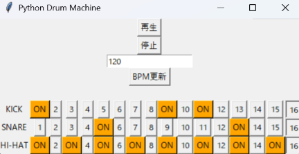

# Python Drum Machine

PythonとTkinterを使用して作成した、16ステップ式のドラムマシンアプリです。

KICK、SNARE、HI-HATの3種類のドラムパターンを自由に設定し、
指定したBPMに合わせてパターンを繰り返し再生できます。

## アプリ画面



## 主な機能

- KICK / SNARE / HI-HATの16ステップパターン作成
- ステップのON・OFF切り替え
- ONステップの色表示
- 現在の再生位置の表示
- BPMの変更
- 不正なBPM入力時のエラー表示
- ドラムパターンの自動ループ再生
- pygameによるドラム音声再生

## 使用技術

- Python
- Tkinter
- pygame-ce
- pytest
- Git / GitHub

## セットアップ

### 1. リポジトリを取得

```bash
git clone https://github.com/ggg-dr/Python_Drum_Machine.git
cd Python_Drum_Machine
```

### 2. 仮想環境を作成

```bash
python -m venv .venv
```

Windowsの場合：

```bash
.venv\Scripts\activate
```

### 3. 必要なライブラリをインストール

```bash
python -m pip install -r requirements.txt
```

### 4. ドラム音源を配置

`sounds` フォルダを作成し、以下の3つのWAVファイルを配置してください。

```text
sounds/
├── kick.wav
├── snare.wav
└── hihat.wav
```

※ 音源ファイルはリポジトリには含まれていません。

## 起動方法

```bash
python main.py
```

## テスト

```bash
python -m pytest
```